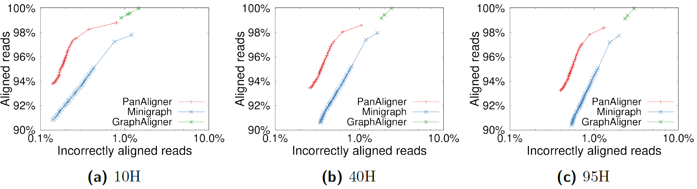

# <a name="started"></a>Getting Started

```sh
git clone https://github.com/at-cg/PanAligner
cd PanAligner && make
# Map sequence to graph
./PanAligner -cx lr test/MT.gfa test/MT-orangA.fa > out.gaf
```

## Table of Contents

- [Getting Started](#started)
- [Introduction](#intro)
- [Users' Guide](#uguide)
- [Installation](#install)
  - [Sequence mapping](#map)
  - [Hybrid method](#hybrid)
  - [Benchmark](#bench)
- [Citation](#cite)

## <a name="intro"></a>Introduction

PanAligner is an efficient tool to align long-reads or assembly contigs to  a cyclic pangenome graph. We follow the seed-chain-extend procedure. We provide the first exact implementation of co-linear chaining technique which is generalized to cyclic graphs. The details of the formulation and the algorithm are provided in our paper. If the input graph is a DAG, PanAligner works similarly as [minichain](https://github.com/at-cg/minichain.git). We benefit from open-source code from [minichain](https://github.com/at-cg/minichain.git), [minigraph](https://github.com/lh3/minigraph.git), and [GraphChainer](https://github.com/algbio/GraphChainer.git) for other necessary components besides co-linear chaining. PanAligner can scale to human pangenome graphs and whole-genome sequencing read sets.

## <a name="uguide"></a>Users' Guide

### <a name="install"></a>Installation
To install PanAligner, type `make` in the source code directory.

#### Dependencies
1) [gcc9][gcc9] or later version
2) [zlib][zlib]


### <a name="map"></a>Sequence mapping
PanAligner can be used for both sequence-to-sequence alignment and sequence-to-graph mapping. For sequence-to-sequence alignment, PanAligner maps a read to a reference in fasta format and provide read mapping output in [PAF][paf] format. For sequence-to-graph mapping, PanAligner takes the graph in [GFA][gfa1] and [rGFA][rGFA] format as input, and provides read mapping in [GAF][gaf] format.

```sh
# Map sequence to sequence
./PanAligner -cx lr test/MT-human.fa test/MT-orangA.fa > out.paf
# Map sequence to graph
./PanAligner -cx lr test/MT.gfa test/MT-orangA.fa > out.gaf
```


### <a name="hybrid"></a>Hybrid method
The Hybrid method leverages the strengths of both [minigraph](https://github.com/lh3/minigraph.git) and PanAligner to achieve efficient and accurate sequence-to-graph mapping. This method is designed to identify a subset of reads that are relatively "easy-to-align" and utilizes the fast [minigraph](https://github.com/lh3/minigraph.git) heuristics for aligning them. For the remaining reads, PanAligner is used for the alignment. 

Before running the Hybrid Method, ensure that [minigraph](https://github.com/lh3/minigraph.git) and [conda](https://docs.conda.io/en/latest/) are installed and available in your PATH. And PanAligner executable is also present in the Hybrid method folder.

```sh
# Inside PanAligner/Hybrid method folder
conda install -c bioconda seqtk
./HybridMethod.sh input_graph.gfa reads.fa out.gaf number_of_threads

# Provide input graphs path, read file path and number of threads
# Provide out.gaf output file name and path
```
## <a name="bench"></a>Benchmark

We evaluated PanAligner against other sequence-to-graph aligners to assess its scalability and accuracy advantages. The evaluation utilized human pangenome graphs constructed from [94 high-quality haplotype assemblies](https://github.com/human-pangenomics/HPP_Year1_Assemblies) provided by the Human Pangenome Reference Consortium, along with the [CHM13 human genome assembly](https://www.ncbi.nlm.nih.gov/assembly/GCA_009914755.4) from the Telomere-to-Telomere consortium. Simulated long-reads with 0.5× coverage and 5% error-rate were used for the experiments, employing cyclic graphs of sizes 10H, 40H, and 95H, where the prefix integer represents the haplotype count in each graph. The results demonstrated superior read mapping precision, as shown in the [figure](#Plot). Notably, even on the largest graph with 95 haplotypes, PanAligner achieved efficient performance, requiring 2 hours and 36 minutes, 44 GB RAM, and 32 threads on [perlmutter CPU nodes](https://docs.nersc.gov/systems/perlmutter/architecture/#cpu-nodes).


<p align="center" id="Plot">
  <a href="./data/plot.png">
    
  </a>
</p>


## <a name="cite"></a>Citation
Jyotshna Rajput, Ghanshyam Chandra, Chirag Jain. [Co-linear Chaining on Pangenome Graphs](https://www.biorxiv.org/content/10.1101/2023.06.21.545871v1). WABI 2023

[gwfa]: https://arxiv.org/abs/2206.13574
[paper_1]: https://genomebiology.biomedcentral.com/articles/10.1186/s13059-020-02168-z
[paper_2]: https://www.biorxiv.org/content/10.1101/2022.08.29.505691v2
[minichain]: https://github.com/at-cg/minichain
[zlib]: http://zlib.net/
[gcc9]: http://zlib.net/
[rgfa]: https://github.com/lh3/gfatools/blob/master/doc/rGFA.md
[gfa1]: https://github.com/GFA-spec/GFA-spec/blob/master/GFA1.md
[gaf]: https://github.com/lh3/gfatools/blob/master/doc/rGFA.md#the-graph-alignment-format-gaf
[paf]: https://github.com/lh3/miniasm/blob/master/PAF.md
